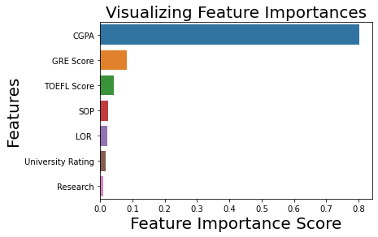
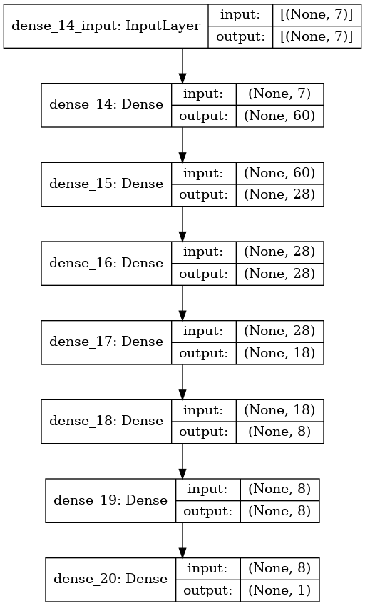
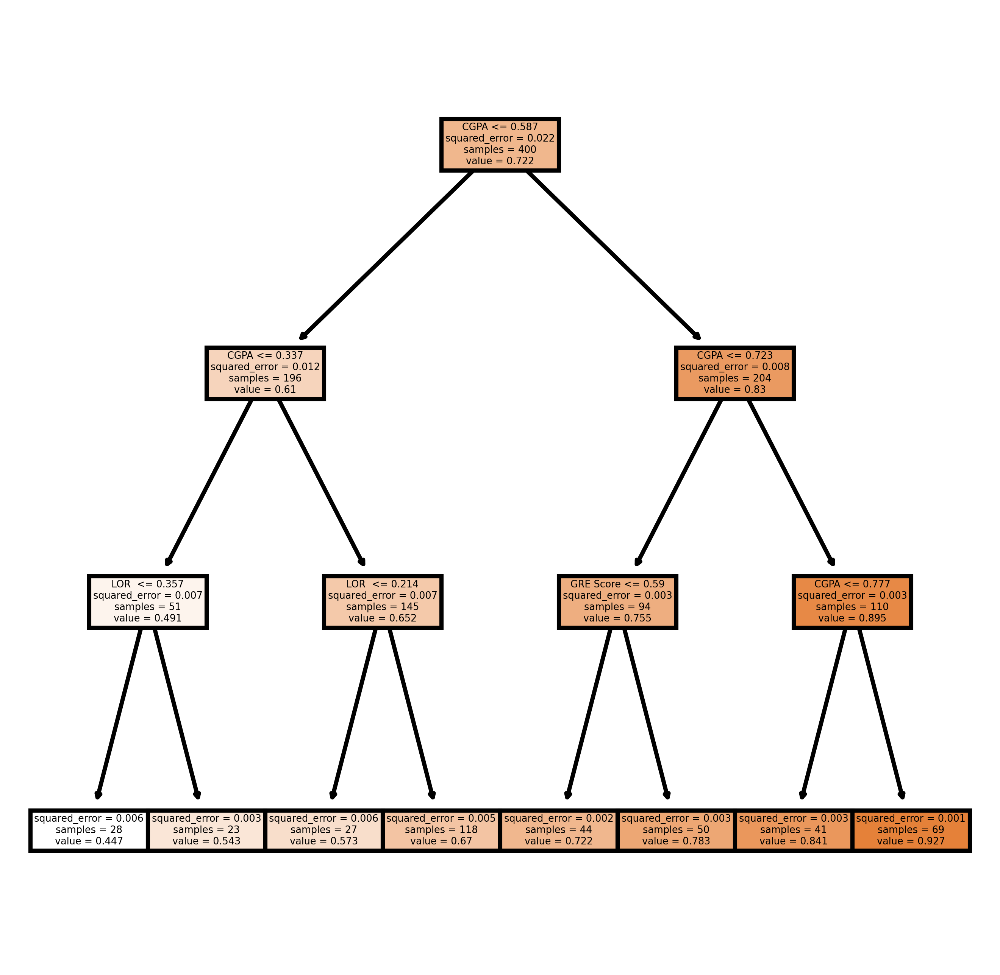

# Admission Chance Predictor

## Overview

This project aims to predict the chance of admission for students based on features such as Letter of Recommendation (LOR), CGPA, GRE score, etc. We use various machine learning algorithms including Artificial Neural Network (ANN), AdaboostRegressor, XGBoostRegressor, and RandomForestRegressor for prediction.

## Features Importance

Below are the important features extracted from the RandomForest model:

 <br>

<br>

## ANN Architecture

The architecture of the Artificial Neural Network (ANN) used in this project is as follows:



## Visualizing Adaboost Tree

Here is an example of one of the Adaboost trees used in the AdaboostRegressor:



##Link to pandas-profiling:
<a href="https://ka-us-tubh.github.io/admission-predictor/">link</a>

## Files Included

1. `ann.png`: Image of the ANN architecture used in the project.
2. `adaboost.png`: Image visualizing one of the Adaboost trees used.
3. `fe.png`: Image visualizing one of the important features used.
4. `train_adaboost.py`: Jupyter file for training and evalution of the different ML models used.
5. `README.md`: Documentation file explaining the project and how to use it.

## Dependencies

This project requires the following Python libraries:

- NumPy (for numerical computations)
- Pandas (for data manipulation)
- Scikit-learn (for machine learning algorithms)
- Matplotlib (for plotting)

You can install the dependencies using `pip`:

```
pip install numpy pandas scikit-learn matplotlib
```

## Note

- Experiment with different algorithms and hyperparameters to improve the prediction accuracy.
- Ensure that your dataset is properly cleaned and preprocessed before training the models.

## Author

[Kaustubh Gupta]

